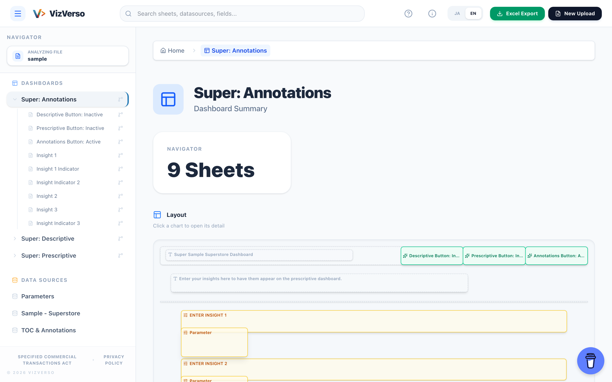

# VizVerso

Tableauの裏側を覗き、その構造とロジックを解明するための twbx 解析ツール
A twbx analysis tool for peeking into the backend of Tableau and unraveling its structure and logic.

**🔗 Live Demo: <https://viz-verso.pages.dev/>** — サンプルワークブックですぐに試せます / Try it instantly with a sample workbook.

## 概要 / Overview

**VizVerso** は、Tableau ワークブック（.twb / .twbx）の内部構造を解析し、ダッシュボード、ワークシート、計算フィールド、パラメータ、データソースなどの依存関係を可視化・エクスポートするためのツールです。

**VizVerso** is a tool designed to analyze the internal structure of Tableau workbooks (.twb / .twbx), allowing you to visualize and export dependencies between dashboards, worksheets, calculated fields, parameters, and datasources.

## 主な機能 / Features

- **内部構造の可視化**: ワークブックに含まれる全エンティティの関係性をブラウザ上で探索。
- **計算フィールドの解析**: 複雑な計算ロジックや依存関係を詳細に表示。
- **Excel エクスポート**: 開発者やドキュメント作成に役立つ詳細な定義一覧を Excel 形式で出力。
- **マルチレイヤー解析**: 二重軸やマップレイヤーなど、Tableau 特有の複雑なペイン構造を解明。
- **未使用フィールド検出**: どのシート・計算式・ダッシュボード（パラメータコントロールや動的ゾーン表示を含む）からも参照されていないフィールドを検出し、バッジ表示と Excel 出力の「使用状況」列で確認可能。
- **計算式コピー**: フィールド詳細ドロワーからワンクリックで計算式をクリップボードにコピー。
- **ワークブック比較（β）**: 2つのワークブックを比較し、シート・計算フィールドなどの差分を表示。

- **Structure Visualization**: Explore relationships between all entities within a workbook in your browser.
- **Calculated Field Analysis**: View detailed calculation logic and dependencies.
- **Excel Export**: Generate detailed definition lists in Excel format for developers and documentation.
- **Multi-layer Analysis**: Unravel complex pane structures like dual axes and map layers.
- **Unused Field Detection**: Detect fields not referenced by any sheet, calculation, or dashboard (including parameter controls and dynamic zone visibility), with badge indicators and a "Usage Status" column in the Excel export.
- **Formula Copy**: Copy a calculated field's formula to the clipboard with one click from the field detail drawer.
- **Workbook Diff (beta)**: Compare two workbooks and see differences in sheets, calculated fields, and more.

## 技術スタック / Tech Stack

- React 19
- TypeScript
- Vite
- Tailwind CSS
- fast-xml-parser (XML Analysis)
- JSZip (twbx Extraction)
- SheetJS (Excel Export)

## ライセンス / License

MIT License
